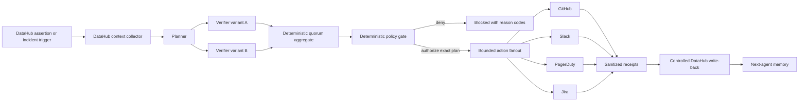
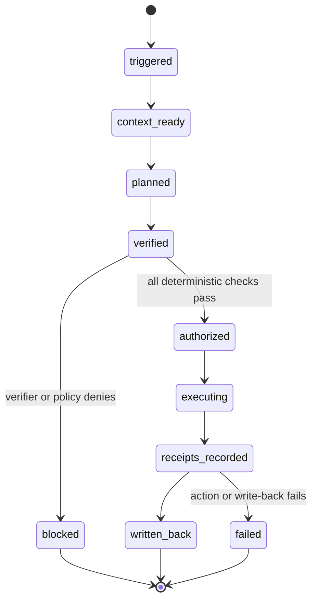

# LedgerLens Architecture

## Autonomous Data Incident Commander

LedgerLens is a contest-period **working prototype** for turning a DataHub-observed incident into
bounded response work, controlled metadata write-back, and a provenance-preserving handoff for the
next agent.

It is not a production incident-management system, an independent validator, a root-cause engine,
or evidence of model uplift.

```yaml
candidateOnly: true
canClaimAGI: false
```

## End-to-end contract



The visible judge path is:

```text
trigger
  -> catalog context
  -> plan
  -> structured verifier variants
  -> deterministic authorization
  -> collaboration fanout
  -> DataHub receipt write-back
  -> recovery-verifier handoff
```

The fixture demo replays that contract without network access. Live execution requires an injected
backend, explicit mutation enablement, allowlisted targets, provider credentials, and separately
published receipts.

## Component boundaries

### 1. Trigger and incident envelope

An incident begins with a typed, idempotency-keyed trigger. A trigger may reference a DataHub
assertion, an incident record, or another externally observed signal.

The trigger is evidence that a signal was recorded. It does not prove:

- root cause;
- customer or user impact;
- the correctness of the source assertion;
- recovery or resolution.

The incident envelope preserves the signal source, event time, affected entity URN, severity,
evidence references, and claim ceiling.

### 2. DataHub context

The context collector resolves operational metadata needed to plan bounded work:

| Context | Use in the plan |
|---|---|
| Entity URN and type | Stable target identity |
| Ownership and stewardship | Accountable routing without inventing an owner |
| Tier/domain/data product | Priority and business context |
| Schema and assertions | The observed defect and affected field |
| Documentation/runbook | Recovery instructions as references, not automatically trusted commands |
| Upstream/downstream lineage | Bounded blast-radius candidates |
| Observation/audit metadata | Timestamp semantics and provenance |

Lineage proximity is not proof of actual user impact or causality. The context model therefore
records both supported facts and unknowns.

The synthetic public catalog contains DataHub-shaped assets, owners, schemas, documentation,
lineage, incidents, and benchmark scenarios. Its records use reserved `.invalid` URLs and cannot
support a live-integration claim.

### 3. Planner

The planner receives only the typed incident context and proposes an `ActionPlan`. The plan carries:

- incident and planner identities;
- an objective and confidence;
- ordered typed actions;
- exact targets and parameters;
- risk and reversibility;
- evidence fact IDs for every action;
- assumptions and unresolved unknowns;
- an idempotency key per action.

The plan can propose collaboration records and DataHub metadata write-back. It cannot authorize
itself, change allowlists, or claim that an incident is resolved.

The deterministic fixture uses a replayed plan. Optional model-backed planning uses a configured
OpenAI-compatible endpoint, but model output remains untrusted structured input to later gates.

### 4. Verifier variants

Each verifier returns a structured assessment bound to the same incident and plan:

- approve/deny;
- confidence;
- reasons;
- unverifiable fact IDs;
- unverifiable action IDs;
- verifier identifier and configured family label.

The aggregate requires unique configured verifier labels, a quorum, minimum confidence, no
unverifiable items, and no verifier errors. Planner/verifier label overlap fails closed.

This is an engineering separation rule. **LedgerLens does not claim that configured model labels
prove provider-family independence or statistically independent judgment.** A public submission
must call them verifier variants unless provider independence is separately evidenced.

Verifier prose has no execution authority.

### 5. Deterministic authorization policy

The policy gate evaluates machine-checkable conditions after verification:

1. incident, plan, and verifier identities match;
2. the incident remains actionable;
3. plan confidence and verifier quorum meet configured thresholds;
4. every action type is allowlisted;
5. every target is allowlisted;
6. every parameter key is allowlisted and every required key is present;
7. action risk is within the allowance;
8. every action cites known context facts;
9. the action count is bounded;
10. the exact plan fingerprint still matches at execution time.

Any failure returns stable reason codes and no authorized action IDs.

The dashboard also supports operator-confirmed mode, where the operator must type an exact
plan-bound confirmation and acknowledge the claim boundary. Autonomous replay mode constructs the
same exact request only after the structured verifier checks pass.

### 6. GitHub, Slack, PagerDuty, and Jira fanout

Provider actions are represented as typed previews before execution. The common adapter layer adds:

- action digest and normalized idempotency key;
- short-lived HMAC authorization bound to the exact preview;
- target-specific request validation;
- bounded retries;
- conservative handling of ambiguous remote outcomes;
- in-memory or SQLite idempotency state;
- sanitized remote IDs and URLs;
- ordered fanout results.

Implemented adapter shapes:

| Provider | Bounded operation |
|---|---|
| GitHub | Create an incident work-item issue |
| Slack | Post a bounded incident brief by webhook or Web API |
| PagerDuty | Trigger, acknowledge, or resolve an Events API record; the judge replay shows an incident-note-shaped collaboration step |
| Jira | Create a recovery/follow-up issue |

The fixture backend never calls those APIs. It returns clearly labeled `fixture://` receipts so the
UI can demonstrate receipt propagation without implying live execution.

### 7. Controlled DataHub write-back

DataHub mutation is separate from the read-only MCP client and disabled by default.

```text
write-back request
  -> deterministic policy preview
  -> exact-call authorization
  -> allowlisted official MCP mutation tool
  -> before/after snapshot where available
  -> sanitized write-back receipt
```

Supported controlled mutation shapes include:

- save a bounded incident document;
- add/remove tags;
- update an entity description;
- add/remove structured properties.

The mutation client rejects:

- disabled execution;
- unsupported or non-allowlisted tools;
- missing typed authorization;
- authorization that does not match the exact call digest and idempotency key;
- targets outside configured URN prefixes;
- sensitive-looking argument keys;
- unsuccessful or malformed mutation responses.

DataHub write-back records what the commander attempted and observed. It does not certify cause,
impact, recovery, or source truth.

### 8. Next-agent memory

The final handoff is a structured continuation artifact, not hidden chat history. It contains:

```json
{
  "nextAgent": "Recovery verifier",
  "knownFacts": [],
  "unknowns": [],
  "completed": [],
  "nextActions": [],
  "provenance": [],
  "candidateOnly": true,
  "canClaimAGI": false
}
```

The fixture UI materializes this object after replayed fanout and write-back. In live mode, durable
persistence and retrieval of the handoff must be evidenced by the injected backend or a published
run receipt; the architecture alone is not proof that a hosted memory write occurred.

## Orchestration state machine



The run and action caches use idempotency keys to return a recorded result for an exact replay and
to reject collisions.

## Execution modes

| Mode | Network | External mutations | Safe claim |
|---|---:|---:|---|
| Incident fixture replay | No | No | Complete visible workflow over synthetic data with `fixture://` receipts |
| Deterministic catalog benchmark | No | No | Rule-based DataHub-context ON/OFF comparison on synthetic scenarios |
| Local DataHub smoke | Yes, localhost | Explicit ingestion/read path | Compatibility for the exact recorded DataHub version and receipt only |
| Injected live Incident Commander backend | Depends on host | Disabled unless explicitly enabled and authorized | No public claim until current external and DataHub receipts are published |
| Hosted judge environment | Deployment-owned | Must be least-privilege and resettable | No claim that it is live until the public URL and health receipt are verified |

Deployment details are owned by [docs/HOSTED_DEMO.md](docs/HOSTED_DEMO.md).

## Trust boundaries

```text
Untrusted:
  incident prose
  runbook and evidence references
  user prompts
  planner output
  verifier output
  provider response bodies

Conditionally trusted after validation:
  typed incident context
  DataHub API/MCP responses
  provider receipts
  before/after snapshots

Authoritative for authorization mechanics, not incident truth:
  deterministic policy
  allowlists
  action digest
  plan fingerprint
  idempotency store

Never established by the system:
  causality
  actual user impact
  recovery
  incident resolution
  provider-family independence
  independent validation
  validated uplift
  production readiness
  AGI
```

## Data and timestamp semantics

Every surfaced field should preserve its source class:

| Class | Meaning |
|---|---|
| Source assertion | A supplied or externally observed statement |
| DataHub metadata | Catalog state, ownership, lineage, assertion, or audit data |
| Planner proposal | A candidate action, not authorization |
| Verifier advisory | A bounded assessment, not execution permission |
| Policy decision | Deterministic authorization result for an exact plan |
| Provider receipt | Sanitized record of an accepted/deduplicated action when live; `fixture://` in replay |
| Unknown | Missing or unproven information that must remain explicit |

DataHub ingestion or observation time is not a source-validation timestamp. Temporal adjacency
between a deploy and an incident is not causality.

## Security defaults

| Operation | Default |
|---|---|
| Read deterministic fixture | Enabled |
| Read configured DataHub metadata | Explicit configuration |
| Planner/verifier model calls | Disabled without credentials and feature flags |
| Provider actions | Require typed authorization and credentials |
| DataHub MCP mutations | Disabled |
| Autonomous execution | Disabled in application settings; explicitly selected for fixture replay |
| Arbitrary evidence URL fetching | Disabled |
| Production rollback | Not implemented by the judge workflow |
| Claim-ceiling change | Forbidden |

Secrets belong in environment variables or deployment secret stores. They must never enter
planner prompts, verifier prompts, previews, receipts, screenshots, generated reports, or git.

## Judge-proof rule

The UI, docs, video, and Devpost text must keep these distinctions visible:

- implemented adapter is not a live integration claim;
- fixture receipt is not a real external receipt;
- configured verifier label is not provider-family independence;
- benchmark pass is not validated uplift;
- DataHub write-back is not validation;
- metadata blast radius is not proven user impact;
- planned or authorized action is not incident recovery.

All outputs preserve:

```yaml
candidateOnly: true
canClaimAGI: false
```
