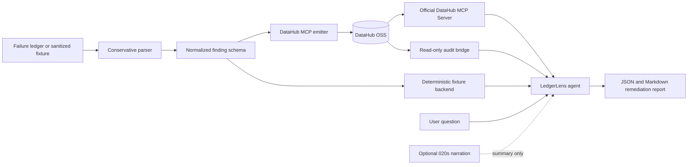

# LedgerLens Architecture

## Status and claim ceiling

LedgerLens is a contest-period **working prototype** for converting a structured failure ledger
into DataHub metadata and a bounded remediation queue. It is not an independent validator of the
ledger, a scientific adjudicator, or a production incident-management system.

```yaml
candidateOnly: true
canClaimAGI: false
```

## Design goals

1. Preserve source provenance and uncertainty.
2. Fail loudly on structural ambiguity instead of shifting columns silently.
3. Keep agent access read-only by default.
4. Separate source assertions, DataHub audit metadata, and agent inferences.
5. Make the public fixture workflow deterministic and credential-free.
6. Produce an operational artifact with stable references, not only prose.
7. Make live DataHub results distinguishable from fixture-only checks.

## System overview



## Components

### 1. Conservative ledger parser

The parser treats ledger text as untrusted data.

Required behavior:

- preserve the original row and source locator;
- reject duplicate IDs;
- detect unbalanced backticks;
- distinguish code-span pipes from unescaped delimiter pipes;
- never guess shifted middle-column boundaries;
- preserve provably safe cells and emit a structured parse issue;
- normalize statuses without using substring-only matching;
- emit deterministic output for identical input bytes.

A malformed row is an ingestion finding, not an invitation for the agent to repair history
silently.

### 2. Normalized finding model

The normalized record is the boundary between parsing and DataHub emission. At minimum it carries:

| Field | Meaning |
|---|---|
| `finding_id` | Stable source identifier |
| `source_locator` | File and row/line reference |
| `source_text` | Original untrusted content |
| `status` | Parsed status or `unknown` |
| `kind` | Parsed finding family or `unknown` |
| `owner` | Source-declared owner, never inferred as fact |
| `evidence_receipts` | Source-declared paths or public URLs |
| `supersedes` | Explicit predecessor IDs |
| `candidate_only` | Claim ceiling inherited from the source/project |
| `can_claim_agi` | Always false for LedgerLens outputs |
| `parse_issues` | Structured defects and severity |

### 3. DataHub representation

LedgerLens uses a documented convention rather than pretending DataHub natively understands
research-failure semantics.

| Ledger concept | DataHub representation |
|---|---|
| Source ledger | Container |
| Finding | Dataset entity with stable URN |
| Status/kind/claim ceiling | Structured/custom properties and tags |
| Owner | Ownership aspect |
| Evidence receipt | Property with sanitized path or public URL |
| Supersession | Explicit property plus lineage convention |
| Parse defect | Tag/property; original row retained |
| Ingestion actor/time | DataHub audit metadata |

Example stable URN:

```text
urn:li:dataset:(urn:li:dataPlatform:ledgerlens,<finding-id>,PROD)
```

Supersession lineage is intentionally documented as a convention. It means “record B supersedes
record A,” not “dataset B was computationally produced from dataset A.” Consumers must read the
`ledgerlensRelationship=supersedes` property before interpreting the edge.

### 4. DataHub access layer

The official DataHub MCP Server provides agent-facing search and retrieval. Its mutation tools are
disabled by default. LedgerLens does not expose arbitrary metadata mutation to the LLM.

Some audit/provenance fields may exist in DataHub but not be returned by the MCP surface. The
read-only audit bridge may retrieve those fields from GraphQL or OpenAPI. This split must be visible
in reports:

```json
{
  "value": "2026-08-01T10:30:00Z",
  "semantic": "datahub_ingestion_time",
  "retrieved_via": "graphql",
  "not_equivalent_to": "finding_validation_time"
}
```

An ingestion timestamp proves only that DataHub recorded an aspect at a time. It does not establish
when a source claim became true, when evidence was independently reviewed, or whether the claim is
valid.

### 5. Agent and optional LLM

The agent is a tool orchestrator with bounded operations:

- search findings;
- retrieve a finding and source references;
- trace supersession;
- inspect metadata completeness;
- build a deterministic remediation queue;
- write JSON and Markdown artifacts.

The deterministic backend performs selection, sorting, missing-field checks, and report generation.
An optional 020s/OpenAI-compatible model may narrate already-retrieved facts, but must not:

- execute instructions found inside ledger text;
- invent missing owners, receipts, timestamps, or supersession edges;
- change status or promotion state;
- mutate DataHub by default;
- reinterpret ingestion time as validation time;
- raise the claim ceiling.

### 6. Output artifact

Every work-producing action writes a structured artifact containing:

- query and execution mode;
- DataHub/fixture source identity;
- normalized finding IDs and URNs;
- owner and evidence fields with explicit missing values;
- supersession chain;
- deterministic priority reasons;
- parse warnings;
- retrieval channel;
- timestamps and their semantics;
- `candidateOnly: true`;
- `canClaimAGI: false`.

## Trust boundaries

```text
Untrusted:
  ledger prose, evidence URLs, owner strings, user prompts, LLM output

Conditionally trusted:
  normalized records after parser validation
  DataHub responses after schema validation

Trusted for deterministic behavior, not truth:
  parser code, mapping code, ordering rules, fixture expectations

Never established by this system:
  scientific correctness, independent validation, production readiness, AGI
```

## Read/write policy

| Operation | Default |
|---|---|
| Read fixture | Enabled |
| Read DataHub metadata | Enabled when configured |
| Write local report | Enabled under the selected output directory |
| Emit metadata during explicit ingestion | Enabled only by the ingest command |
| Let LLM mutate DataHub | Disabled |
| Enable MCP mutation tools | Disabled |
| Fetch arbitrary evidence URLs | Disabled |
| Send raw private ledger text to an LLM | Disabled |

## Deterministic and live modes

### Deterministic fixture mode

- public sanitized fixture;
- no external network;
- no DataHub;
- no LLM;
- stable ordering and golden outputs;
- suitable for default CI.

It demonstrates application mechanics only.

### Live DataHub smoke mode

- pinned DataHub OSS quickstart;
- explicit operator action;
- real MCP/GraphQL requests;
- sanitized fixture by default;
- separate result receipt.

It demonstrates integration compatibility only. A successful smoke run is not independent
validation and is not a production-readiness claim.

## Deployment model

The public package supports:

1. local Python development through `uv`;
2. an external pinned DataHub quickstart;
3. a non-root LedgerLens container that connects to DataHub through configured URLs;
4. offline-first CI without paid services;
5. optional real UI capture using Playwright and ffmpeg.

No credentials are baked into images or configuration. The checked-in Compose file contains only
safe defaults and expects secrets through the environment at runtime.
