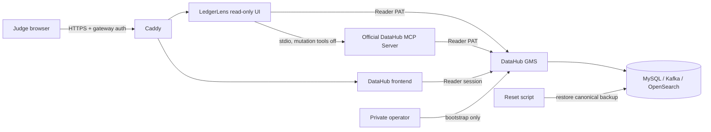

# LedgerLens Grand Prize Plan

## Objective

Present LedgerLens as an **Autonomous Data Incident Commander** that uses DataHub as both the
operational context and durable receipt/memory layer while preserving provenance, uncertainty, and
deterministic authority boundaries.

The submission should make seven facts easy for judges to verify:

1. a realistic 120-asset, four-domain catalog can be mapped into DataHub OSS;
2. the official DataHub MCP Server supplies entity and lineage context;
3. a real planner and two verifier variants produce typed, auditable outputs;
4. deterministic policy—not model prose—authorizes the exact plan;
5. GitHub, Slack, PagerDuty, and Jira adapters perform bounded, receipted work;
6. controlled DataHub write-back records the run for the next recovery agent;
7. fixture, live-AI, real-provider, and unavailable states remain visibly distinct.

```yaml
candidateOnly: true
canClaimAGI: false
externalValidation: false
```

## Prize thesis

The strongest differentiator is not a broad autonomous-agent claim. It is an inspectable incident
command loop that converts catalog context into bounded work without erasing ambiguity:

```text
DataHub trigger
  -> entity + owner + schema + runbook + lineage context
  -> planner
  -> two verifier variants
  -> deterministic policy
  -> provider action fanout
  -> receipts
  -> DataHub write-back
  -> next-agent memory
```

Judges should be able to inspect the same finding in LedgerLens, DataHub, MCP-backed output, and the
downloaded receipt. Each layer should answer “where did this field come from?” without implying
that ingestion proves source truth.

## Deliverables

### 1. Public live judge environment

Owned implementation:

- `deploy/docker-compose.judge.yml`
- `deploy/Caddyfile.template`
- `deploy/bin/`
- `deploy/scenarios/`
- `docs/HOSTED_DEMO.md`
- `.github/workflows/deploy-incident-demo.yml`

Acceptance:

- HTTPS only;
- gateway authentication;
- native DataHub Reader judge;
- separate Reader service PAT;
- no public DataHub backend/data-store ports;
- DataHub policies, metadata auth, and REST authorization enabled;
- mutation tools, document writes, user tools, LLM calls, and LedgerLens mutations disabled;
- scenario reset from a recorded baseline;
- automatic stop TTL;
- health gate verifies effective privileges, not only HTTP 200.

### 2. Judge walkthrough

Three resettable paths use the same canonical snapshot:

| Scenario | Proof point | Failure to avoid |
|---|---|---|
| Baseline | Queue is a real work artifact with stable DataHub references | “Agent” is only a chat summary |
| Missing metadata | Unknown owner/evidence remains unknown | Invented or overconfident completion |
| Supersession | History and current state remain connected | New record silently deletes old context |

The under-three-minute video remains the fastest narrative. The hosted environment lets judges
repeat the same operations and download the result.

### 3. Upstream contribution

Open a narrowly scoped issue against the official `acryldata/mcp-server-datahub` project proposing
optional read-only aspect provenance in `get_entities`. Do not mix the contest deployment with an
unreviewed upstream fork. See `docs/UPSTREAM_MCP_CONTRIBUTION.md`.

## Architecture



Trust boundaries:

- judge credentials never receive root or service passwords;
- LedgerLens receives only the Reader PAT;
- the private root token exists only during provisioning/health verification;
- all DataHub quickstart ports bind to loopback;
- Caddy is the only public container;
- the cloud firewall is still required;
- all seeded data is the existing sanitized public fixture.

## Deployment decision

### Selected: one Docker VM + Compose

Reasons:

- no confirmed VM-provider API credential exists;
- DataHub quickstart already targets Docker Compose;
- a single VM is the smallest environment judges can reproduce;
- Caddy supplies automatic TLS without provider-specific integration;
- GitHub can deploy over pinned-host-key SSH when the owner supplies safe auth;
- reset and cost controls can remain cloud-neutral.

### Not selected

| Option | Reason |
|---|---|
| Cloudflare Workers/Pages only | Cannot host the full DataHub Docker quickstart |
| Unauthenticated public quickstart | Default credentials and exposed backing-service ports are unsafe |
| Automatic provider provisioning | No confirmed provider credential or account boundary |
| Kubernetes | Higher cost and operational complexity for a temporary judge window |
| Public GMS/MCP endpoint | Unnecessary attack surface; LedgerLens can keep MCP stdio internal |
| Paid LLM narration | Adds secrets, cost, and variability without improving the core proof |

## Security gates

The deployment is a **NO-GO** if any item fails:

- DNS does not resolve to the intended VM;
- TLS cannot be issued;
- cloud firewall exposes a DataHub/backend port;
- SSH host-key pinning is absent;
- `datahub:datahub` still works;
- judge or service user has any platform privilege;
- judge or service user has a metadata privilege outside the read allowlist;
- MCP mutation tools are registered;
- LedgerLens `/healthz` cannot confirm DataHub and MCP connectivity;
- the fixture contains private/non-public data;
- the baseline reset cannot reproduce the judge path;
- no provider billing alert or shutdown plan exists.

## Reliability gates

Before sharing:

1. deploy from a committed `main` revision;
2. run `bash deploy/bin/healthcheck.sh`;
3. reset all three scenarios;
4. test both URLs in a clean/incognito browser;
5. verify DataHub rejects an edit with the judge account;
6. download both LedgerLens report formats;
7. reboot the VM and confirm restart policies recover the stack;
8. confirm the TTL deadline and provider-side shutdown plan;
9. record the release SHA, DataHub version, and health receipts;
10. review screenshots/logs for credentials and private paths.

## Cost plan

Use a right-sized single VM only during the judge window:

- 4 vCPU / 16 GB RAM / roughly 40 GB disk;
- DataHub `v1.6.0` pinned;
- no GPU;
- no paid LLM;
- 24-hour default TTL, at most 168 hours;
- one GitHub deployment concurrency group;
- provider billing alert;
- owner stops/deletes the VM after judging.

The TTL stops Docker workloads, which reduces accidental service exposure and compute load, but it
does not guarantee the provider stops charging for the VM. Provider shutdown remains an owner
step.

## Execution order

### Phase A — package validation

```bash
bash deploy/bin/validate.sh
```

Exit criteria:

- shellcheck passes;
- Python deployment helpers compile;
- official compose hash matches;
- hardened compose parses;
- Caddy config validates;
- workflow passes `actionlint` when available.

### Phase B — owner infrastructure

Owner-only:

1. create the VM;
2. configure inbound firewall;
3. create DNS records;
4. install Docker/uv;
5. create `/opt/ledgerlens-judge`;
6. add protected GitHub Environment secrets;
7. record provider billing alert and shutdown time.

### Phase C — private deployment

Run workflow action `deploy` from `main`. Keep URLs private until:

- DataHub provisioning receipt says both actors are read-only;
- public health passes;
- reset succeeds;
- default credentials fail.

### Phase D — judge release

Share the two URLs and two judge credentials. Keep a second operator browser open for monitoring.
Run workflow action `health` before the judging slot and `reset` between walkthroughs.

### Phase E — shutdown

Run workflow action `stop`, save sanitized receipts, then stop/delete the VM through the provider.
Do not rely on container stop alone for billing control.

## Evidence packet

Keep these private until reviewed, then publish only sanitized material:

- final Git commit SHA;
- DataHub OSS and CLI versions;
- `deploy/state/receipts/datahub-bootstrap.json`;
- `deploy/state/receipts/seed.json`;
- `deploy/state/receipts/datahub-lock-down.json`;
- `deploy/state/receipts/datahub-health.json`;
- health command and UTC time;
- scenario reset results;
- public URLs;
- video URL;
- provider shutdown confirmation.

Receipts establish deployment behavior and configured privileges only. They do not establish source
truth, independent validation, production readiness, model uplift, or AGI.

## Primary risks and mitigations

| Risk | Mitigation |
|---|---|
| Quickstart exposes backing services | Generated compose binds all published ports to loopback; firewall blocks them |
| Default root credential remains | Private `user.props` rotates root password before public ingress starts |
| Reader inherits platform privilege | All-users base platform policy is deactivated; effective privileges are queried |
| LedgerLens token is over-privileged | Separate Reader service identity; runtime never receives root token |
| Judge mutates metadata | DataHub Reader role plus mutation-disabled MCP/application; explicit edit test |
| Reset loses state | Canonical metadata backup after seed/provision; reset health gate |
| TLS/DNS delay | DNS is completed before deploy; Caddy validation and public health block release |
| Surprise cloud bill | TTL watchdog, provider alert, manual VM shutdown |
| Workflow leaks secrets | Protected Environment, no shell tracing, mode-0600 files, pinned SSH host key |
| Upstream contribution expands scope | Issue-first, optional field, mocked tests, no upstream checkout edit here |

## Definition of done

The grand-prize package is ready when:

- deployment validation is green;
- a protected manual workflow can deploy, health-check, reset, and stop the environment;
- judges receive only read-only credentials;
- all public traffic uses HTTPS;
- all non-ingress ports are loopback/firewall restricted;
- scenarios reset from the same canonical snapshot;
- health verifies both connectivity and authorization;
- costs have a TTL and provider shutdown owner;
- the upstream MCP issue/PR plan is ready to paste;
- every public claim remains within the working-prototype ceiling.
